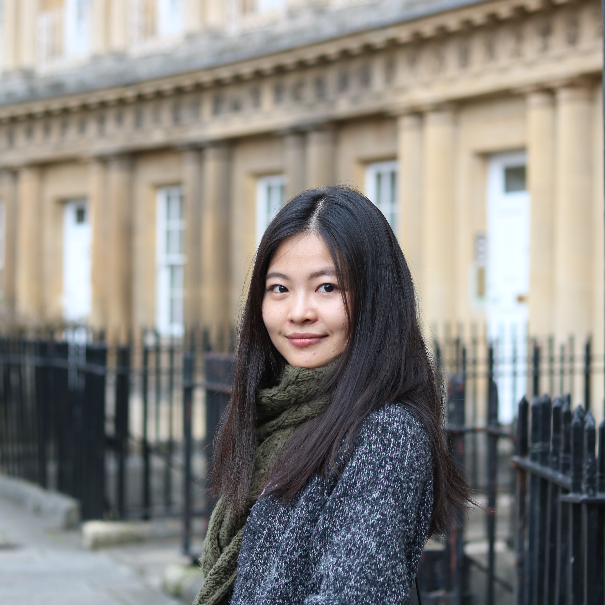

## Biography

I am currently a fifth-year Ph.D candidate of School of Software, Tsinghua University. My supervisor is Prof. Hui Zhang. Prior to that, I received my Bachelor's degree from Sun Yat-Sen University in 2013.

My research interest includes 3D indoor scene understanding, modeling and enhancement.

## Publications

1. Zhang S, Han Z, Zhang H. User guided 3D scene enrichment[C]// ACM SIGGRAPH Conference on Virtual-Reality Continuum and ITS Applications in Industry. ACM, 2016:353-362.
2. Zhang S, Han Z, Martin R R, et al. Semantic 3D indoor scene enhancement using guide words[J]. Visual Computer, 2017:1-11.

## Experiences

This is a [link](http://google.com). Something *italics* and something **bold**.

Here is a table

Year | Award | Category
-----|-------|--------
2014 | Emmy  | Won Outstanding Lead Actor in a miniseries or a movie
2015 | BAFTA | Nominated for Best Leading Actor for Sherlock
2014 | Satellite | Won Best Actor miniseries or television film

Here is a horizontal rule

---

Here is a blockquote

> To a great mind, nothing is little

## References

* Foo Bar: Head of Department, Placeholder Names, Lorem
* John Doe: Associate Professor, Department of Computer Science, Ipsum
