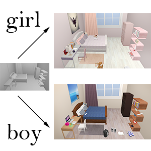

## Biography

I am currently a fifth-year Ph.D candidate of School of Software, Tsinghua University. My supervisor is Prof. Hui Zhang. Prior to that, I received my Bachelor's degree from Sun Yat-Sen University in 2013.

My research interest includes 3D indoor scene understanding, modeling and enhancement.

## Publications

User Guided 3D Scene Enrichment  
**Suiyun Zhang**, Zhizhong Han and Hui Zhang  
Proceedings on Virtual-Reality Continuum and ITS Applications in Industry (VRCAI), 2016  
\[[DOI](https://doi.org/10.1145/3013971.3014002 "paper")\] \[[slides](enrichment.pdf)\]  

 
Semantic 3D Indoor Scene Enhancement Using Guide Words  
**Suiyun Zhang**, Zhizhong Han, Ralph Martin and Hui Zhang  
Visual Computer, 2017:1-11  
\[[DOI](https://doi.org/10.1007/s00371-017-1394-5, "paper")\] \[[slides](enhancement.pdf)\]

## Experiences

This is a [link](http://google.com). Something *italics* and something **bold**.

Here is a table

Year | Award | Category
-----|-------|--------
2014 | Emmy  | Won Outstanding Lead Actor in a miniseries or a movie
2015 | BAFTA | Nominated for Best Leading Actor for Sherlock
2014 | Satellite | Won Best Actor miniseries or television film

Here is a horizontal rule

---

Here is a blockquote

> To a great mind, nothing is little

## References

* Foo Bar: Head of Department, Placeholder Names, Lorem
* John Doe: Associate Professor, Department of Computer Science, Ipsum
